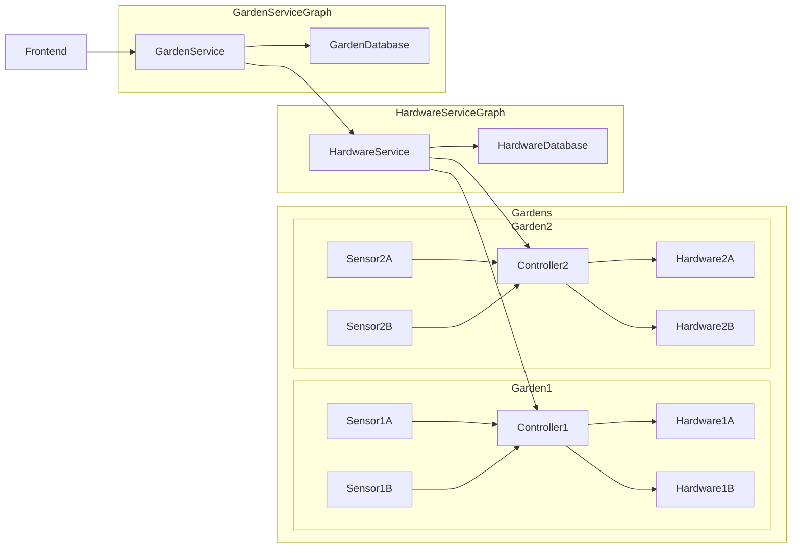

# Plant Project - Hardware Service

Welcome to the Hardware Service repository for the Plant Project, an integral part of our comprehensive plant care solution. This repository focuses on the crucial components that allow our system to interact with and control physical devices, driving all tangible actions taken by our application.

The Hardware Service, in collaboration with the Hardware Controller, translates the high-level commands from our main application into specific instructions that physical devices can understand. In this sense, it acts as the interpreter and executor, enabling our software to influence the real world - turning lights on or off, controlling pumps, adjusting temperature, and much more.

This repository contains the source code and documentation for the Hardware Microservice, Hardware Controller, Hardware components, and Sensors, each playing a unique role in the plant care ecosystem. Together, these components allow us to take care of plants by adjusting their environment according to their specific needs, creating optimal conditions for growth.

The following sections provide detailed insights into each of these components and their role within the system. We also delve into the MQTT protocol and its pivotal role in ensuring efficient and reliable communication between the different elements of the project.

Thank you for your interest in the Plant Project. Feel free to explore, understand, and contribute to our endeavour to blend technology with nature for the love of plants. Enjoy exploring our project!


# System Entities

## Hardware Microservice

The Hardware Microservice is a critical component that acts as the communication bridge between the user-facing application and the actual physical hardware controller. This microservice translates high-level commands received from the application into a series of specific, actionable instructions that the hardware controller can understand and execute. But the Hardware Microservice is more than a simple translation unit. It also plays a vital role in handling error conditions, providing feedback about the system's status, and ensuring the robustness and reliability of the overall system. By leveraging well-established software principles and modern development practices, the Hardware Microservice ensures the system's reliability, responsiveness, and extensibility.

## Hardware Controller

At the heart of the system lies the Hardware Controller. This microcontroller plays the indispensable role of controlling the hardware, executing the instructions it receives from the Hardware Microservice. However, the role of the Hardware Controller goes beyond mere execution of commands. It acts as the system's "hands and feet," interacting with the physical world and performing the actual tasks that maintain the plant's environment. It is the gateway between the software and the real world, carrying out tasks such as turning lights on or off, activating pumps, and many others.

## Hardware

Hardware
The term "Hardware" refers to the physical devices that the system uses to affect the environment. This can be anything from lighting fixtures, watering pumps, fans, heaters, to any other equipment that can be switched on or off. But hardware in this context isn't limited to these examples. Indeed, any device that can be turned on or off, and that can contribute to creating an optimal environment for plant growth, could be considered hardware.

This flexible definition allows our system to be versatile and adaptable, capable of integrating a wide range of devices to serve the needs of diverse plant species. Moreover, our advanced scheduling capabilities mean that hardware can be programmed to activate or deactivate at precise times. This intelligent automation ensures that each piece of hardware performs its function at exactly the right moment to optimize the environment for plant growth, while also conserving energy when it's not needed.

Should the controller for these hardware devices be offline at any given point, the system is designed with resiliency in mind. Messages to activate or deactivate the hardware are queued and patiently wait for the controller to regain connectivity. Once the controller is back online, it promptly receives the queued messages and executes the instructions accordingly. This ensures continuity of service and minimizes any potential disruption caused by temporary network issues, preserving the smooth operation of your plant cultivation environment.

## Sensor

Sensors are the eyes and ears of our system. They continually monitor the environment, gathering vital data such as temperature, humidity, light intensity, soil moisture, and more. This data is not merely collected; it is interpreted and used to make decisions. The role of sensors extends beyond simple data collection; they provide the system with the capability to understand the state of its environment and adjust accordingly. Through precise measurements and reliable operation, our sensors ensure that our system can make accurate decisions, thereby creating and maintaining the optimal conditions for plant health.

## MQTT in the System

MQTT (Message Queuing Telemetry Transport) plays a central role in our system as it serves as the main communication protocol bridging the different components of the project.

**Efficient and Lightweight:** Given the network constraints that often come with IoT devices, MQTT's lightweight nature makes it a solid choice for this project. Its small footprint ensures efficient usage of network bandwidth, crucial when communicating between our Hardware Microservice and the Hardware Controller.

**Publish-Subscribe Model:** Our system takes advantage of MQTT's publish-subscribe architecture, which decouples the sender (publisher) and the receiver (subscriber). This means the Hardware Microservice can send commands to the Hardware Controller, and it can receive sensor data without knowing each other's specific details. This abstraction aids in creating a modular and scalable system design.

**Reliable Message Delivery:** Reliability is key in our project, as missed commands or sensor data could lead to unfavorable conditions for the plants. MQTT offers different quality of service levels to guarantee message delivery, a feature we lean on to ensure reliable communication, particularly vital in IoT environments where networks can be unreliable.

**Asynchronous Communication:** Finally, MQTT supports asynchronous communication which aligns with our system's operational needs. It allows us to send commands or read sensor data at any time without interrupting other processes. This is vital in our project where concurrent communication between different devices and services is a common occurrence.

In a nutshell, MQTT is our go-to communication protocol that brings scalability, efficiency, and reliability to our system, ensuring a smooth interaction between our hardware and software components for optimal plant growth.

# Installation Instructions

The Hardware Service is built as a Spring Boot microservice, making it easy to compile and run on various platforms. Follow the steps below to get started:
markdown

# Installation Instructions

## Hardware Service Client

1. **Clone the Hardware Service Client repository:**

Open your terminal and type in the following command:

```bash
git clone https://github.com/UrbanJungleTech/HardwareService-Client.git
```

After successfully cloning the client repository, you need to build the client. Navigate into the HardwareService-Client directory:

```bash
cd HardwareService-Client
```

Then use Maven to build and install the client library in your local repository:

```bash
mvn clean install
```

This command cleans the target directory, builds your project, and installs the library into your local Maven repository.

1. **Clone and run the Hardware Service**

Clone the Hardware Service repository:

```bash
git clone https://github.com/UrbanJungleTech/HardwareService.git
```

Build the Hardware Service:

Next, navigate into the HardwareService directory:

```bash
cd HardwareService
```

And build the Hardware Service using Maven:

```bash
mvn clean install
```

Run the Hardware Service:

After a successful build, you can run the Hardware Service using the following command:

```bash
java -jar target/hardware-service-0.0.1.jar
```
The Hardware Service will start up and be accessible at the specified endpoint. By default, it runs on http://localhost:8081.

Note: Make sure to configure any required environment variables, database connections, or external service integrations as specified in the project documentation.

You can now interact with the Hardware Service and leverage its functionality to control and monitor physical devices in the Plant Project ecosystem.


# Configuration

All configuration is done via the application.yml file. The following sections describe the various configuration options available.

Local MQTT Server Configuration

    
| parameter          | description                                                                                                                                                                                                                                     | values                           |
|--------------------|-------------------------------------------------------------------------------------------------------------------------------------------------------------------------------------------------------------------------------------------------|----------------------------------|
| local.mqtt.enabled | Determines whether the local MQTT server should be enabled or not. It accepts a boolean value. If set to true, the local MQTT server is enabled. If set to false, the local MQTT server is disabled.                                            | true, false                      |
| local.mqtt.port    | Specifies the port on which the local MQTT server is running. It accepts an integer value.                                                                                                                                                      | 0-65535                          |
| local.mqtt.host    | Specifies the hostname or IP address of the local MQTT server. It accepts a string value.                                                                                                                                                       | Any valid hostname or IP address |
| local.mqtt.logAll  | Determines whether to log all MQTT-related events. It accepts a boolean value. If set to true, all MQTT-related events are logged, which can be useful for debugging and development. If set to false, only significant MQTT events are logged. | true, false                      |


Scheduling Configuration

| parameter                        | description                                                                                                                                                                                       | values |
|----------------------------------|---------------------------------------------------------------------------------------------------------------------------------------------------------------------------------------------------|--------|
| scheduling.distribution-strategy | This property specifies the strategy for distributing scheduled tasks. It accepts a string value. Currently, only the local strategy is supported. With this strategy, all tasks are run locally. | local  |

Development Configuration

| parameter                       | description                                                                                                                                                                                                                                                                                                            | values      |
|---------------------------------|------------------------------------------------------------------------------------------------------------------------------------------------------------------------------------------------------------------------------------------------------------------------------------------------------------------------|-------------|
| development.mqtt-client.enabled | This property determines whether to enable a mock MQTT client for development purposes. It accepts a boolean value. If set to true, a mock MQTT client is enabled, which can be useful for testing the application without having to connect to a real MQTT broker. If set to false, the mock MQTT client is disabled. | true, false |

To modify these properties, update their values in the application.properties (or application.yml) file as per your requirement.

If you are running the application using command line, you can also specify these properties using the -D option, like so:

java -jar app.jar -Dproperty.name=value

Replace property.name with the property you want to update and value with the new value.

# Application Hardware Scheduler Documentation
## Introduction

The schedulars are the core of the system that allow for full automation. Through a combination of automations everything from turning hardware on and off to reading sensors to monitor and react to the system can be achieved.
All the schedulers are based on cron strings which take the form of:
``` 
second minute hour day-of-month month day-of-week year
``` 
For example, the following cron string would run every 5 seconds:
``` 
0/5 * * * * ? *
```
The following cron string would run every 5 minutes:
```
0 0/5 * * * ? *
```

Currently, there are 3 schedulers in the system:

## Hardware Scheduler
Our hardware scheduler utilizes the power of cron strings to automate hardware operations. It uses two distinct cron strings: an "on" cron string and an "off" cron string. These are used to define the times at which the hardware should switch on and off respectively.

To configure the hardware scheduler, a request in the following format should be made:

```json
{
  "onLevel": 5,
  "onCronString": "0/1 * * * * ? *",
  "offCronString": "0/2 * * * * ? *"
}
```

In this configuration, "onLevel" represents the state to which the hardware will be set when the "on" cron string triggers. The "onCronString" and "offCronString" are the cron strings that outline the times for turning the hardware on and off respectively.

The hardware scheduler operates by sending state change messages to the controller at intervals determined by the cron strings. Thanks to the MQTT design of the application, these messages are guaranteed to be delivered, thereby ensuring eventual consistency in the hardware state. This results in a finely tuned control over hardware operation, optimizing its performance and usage.

## Scheduled Sensor Readings

The scheduled sensor readings functionality is a critical feature of our application that ensures a proactive and systematic approach towards monitoring sensor data.

This feature enables users to schedule when sensor readings are taken. Similar to the hardware scheduler, this functionality also leverages cron strings to precisely schedule the intervals at which the readings from a specific sensor are recorded.

To schedule sensor readings, a request in the following format should be made:

```json
{
"sensorId": 1,
"cronString": "0/5 * * * * ? *"
}
```

In this configuration, "sensorId" represents the unique identifier of the sensor from which the readings will be taken. The "cronString" outlines the intervals at which the sensor readings should be recorded. In the given example, readings will be taken every five minutes.

Once scheduled, these sensor readings are stored in the database for future reference.

To retrieve these stored sensor readings, a GET request should be made to /{sensorId}/readings/ with the following parameters:

| Parameter   | Description                                                      | Type       |
|-------------|------------------------------------------------------------------|------------|
| `sensorId`  | unique identifier of the sensor.                                 | `Long`     |
| `startDate` | The starting date-time from which the readings should be fetched | `DateTime` |
| `endDate`   | The ending date-time till which the readings should be fetched   | `DateTime` |


For instance:

```http request
GET /1/readings/?startDate=2023-05-28T00-00-00&endDate=2023-05-28T23-59-59
```

This request will retrieve all scheduled readings for the sensor with id 1, which were recorded on 2023-05-28. This gives users a powerful tool to examine the sensor data in a specific time window, facilitating a detailed analysis and ensuring optimal system performance.
# Communication with the hardware controller

All communication with the hardware controller is done via jsonrpc messages over MQTT. 
Any message with an id expect a response, otherwise the id is optional. 

##JSON-RPC Message Structure

Each JSON-RPC message is structured as follows:

json

{
  "jsonrpc": "2.0",
  "method": "<methodName>",
  "params": {
    "<param1>": "<value1>",
    "<param2>": "<value2>",
    ...
  },
  "id": <id>
}

where jsonrpc is a fixed value indicating the version of JSON-RPC protocol being used, method is the name of the method to be invoked, params is a map containing method parameters, and id is a unique identifier for the request. If id is 0, it indicates that the message does not expect a response.

Here are the available message types:

`RegisterHardware`

This message registers a piece of hardware with the system.

Parameters:

| Parameter | Description                       | Type                  | Example                                        |
|-----------|-----------------------------------|-----------------------|------------------------------------------------|
| `port`    | The port of the hardware          | `long`                | `12345`                                        |
| `state`   | The desired state of the hardware | `HardwareStateEntity` | `{ "stateId": 1, "level": 10, "state": "ON" }` |


Returns: This message does not return a value.

Example:

```json
{
  "jsonrpc": "2.0",
  "method": "RegisterHardware",
  "params": {
    "port": 1,
    "state": {
      "stateId": 100,
      "level": 75,
      "state": "ON"
    }
  },
  "id": 0
}
```
StateChange

This message changes the state of a piece of hardware.

Parameters:

| Parameter      | Description                       | Type                  |
|----------------|-----------------------------------|-----------------------|
| `desiredState` | The desired state of the hardware | `HardwareStateEntity` |
| `port`         | The port of the hardware          | `long`                |

HardwareStateEntity

| Parameter | Description         | Type         |
|-----------|---------------------|--------------|
| `stateId` | The ID of the state | `long`       |
| `level`   | The power level     | `long`       |
| `state`   | The on/off state    | `ONOFF` enum |


Returns: This message returns a message to indicate that the state has been changed.

Example:

```json
{
  "jsonrpc": "2.0",
  "method": "StateChange",
  "params": {
    "port": 1,
    "desiredState": {
      "stateId": 100,
      "level": 50,
      "state": "OFF"
    }
  },
"id": 0
}
```

RegisterSensor

This message registers a sensor with the system.

Parameters:

| Parameter | Description            | Type   | Example |
|-----------|------------------------|--------|---------|
| `port`    | The port of the sensor | `long` | `12345` |


Returns: This message does not return a value.

Example:

```json
{
  "jsonrpc": "2.0",
  "method": "RegisterSensor",
    "params": {
    "port": 1
    },
  "id": 0
}
```

ReadSensor

This message requests a reading from a specific sensor.

Parameters:

| Parameter | Description            | Type   | Example |
|-----------|------------------------|--------|---------|
| `port`    | The port of the sensor | `long` | `12345` |


Returns: This message returns a value from the sensor.

Example:

```json
{
  "jsonrpc": "2.0",
  "method": "ReadSensor",
  "params": {
    "port": 1
  },
  "id": 1
}
```

DeregisterSensor

This message deregisters a sensor from the system.

Parameters:

| Parameter | Description            | Type   | Example |
|-----------|------------------------|--------|---------|
| `port`    | The port of the sensor | `long` | `12345` |


Returns: This message does not return a value.

Example:

```json
{
  "jsonrpc": "2.0",
  "method": "DeregisterSensor",
  "params": {
    "port": 1
  },
  "id": 0
}
```

DeregisterHardware

This message deregisters a piece of hardware from the system.

Parameters:

| Parameter | Description                  | Type       | Example      |
|-----------|------------------------------|------------|--------------|
| `port`    | The port of the hardware     | `long`     | `12345`      |


Returns: This message does not return a value.


ReadAverageSensor

This message requests an average reading from a collection of sensors.

Parameters:

| Parameter | Description              | Type     | Example          |
|-----------|--------------------------|----------|------------------|
| `ports`   | The ports of the sensors | `long[]` | `[12345, 67890]` |


Returns: This message returns an average value from the sensors.

Example:

```json
{
  "jsonrpc": "2.0",
  "method": "ReadAverageSensor",
  "params": {
    "ports": [1, 2, 3]
  },
  "id": 1
}
```

InitialState

This message sets the initial states of a collection of hardware.

Parameters:

| Parameter        | Description                 | Type                        |
|------------------|-----------------------------|-----------------------------|
| `hardwareStates` | The states of the hardwares | `HardwareStateRpcMessage[]` |

Hardware state RPC message:

| Parameter      | Description                       | Type                  |
|----------------|-----------------------------------|-----------------------|
| `desiredState` | The desired state of the hardware | `HardwareStateEntity` |
| `port`         | The port of the hardware          | `long`                |

Hardware state entity:

| Parameter | Description         | Type         |
|-----------|---------------------|--------------|
| `stateId` | The ID of the state | `long`       |
| `level`   | The power level     | `long`       |
| `state`   | The on/off state    | `ONOFF` enum |


Returns: This message does not return a value.

Example:

json

```json
{
    "jsonrpc": "2.0",
    "method": "InitialState",
    "params": {
        "hardwareStates": [
            {
                "port": 1,
                "desiredState": {
                    "stateId": 100,
                    "level": 75,
                    "state": "ON"
                }
            },
            {
                "port": 2,
                "desiredState": {
                    "stateId": 101,
                    "level": 60,
                    "state": "OFF"
                }
            }
        ]
    },
    "id": 0
}
```

