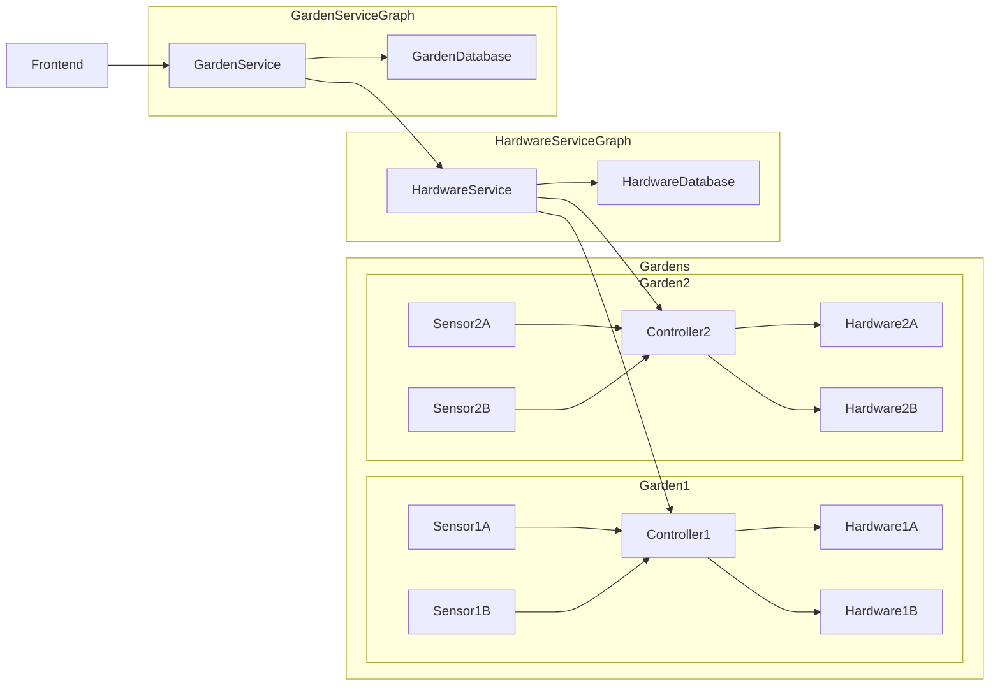

# Plant Project - Hardware Service

Welcome to the Hardware Service repository for the Plant Project, an integral part of our comprehensive plant care solution. This repository focuses on the crucial components that allow our system to interact with and control physical devices, driving all tangible actions taken by our application.

The Hardware Service, in collaboration with the Hardware Controller, translates the high-level commands from our main application into specific instructions that physical devices can understand. In this sense, it acts as the interpreter and executor, enabling our software to influence the real world - turning lights on or off, controlling pumps, adjusting temperature, and much more.

This repository contains the source code and documentation for the Hardware Microservice, Hardware Controller, Hardware components, and Sensors, each playing a unique role in the plant care ecosystem. Together, these components allow us to take care of plants by adjusting their environment according to their specific needs, creating optimal conditions for growth.

The following sections provide detailed insights into each of these components and their role within the system. We also delve into the MQTT protocol and its pivotal role in ensuring efficient and reliable communication between the different elements of the project.

Thank you for your interest in the Plant Project. Feel free to explore, understand, and contribute to our endeavour to blend technology with nature for the love of plants. Enjoy exploring our project!


# System Entities

## Hardware Microservice

The Hardware Microservice is a critical component that acts as the communication bridge between the user-facing application and the actual physical hardware controller. This microservice translates high-level commands received from the application into a series of specific, actionable instructions that the hardware controller can understand and execute. But the Hardware Microservice is more than a simple translation unit. It also plays a vital role in handling error conditions, providing feedback about the system's status, and ensuring the robustness and reliability of the overall system. By leveraging well-established software principles and modern development practices, the Hardware Microservice ensures the system's reliability, responsiveness, and extensibility.

## Hardware Controller

The Hardware Controller is the crucial interface between the system's software and its physical components. Its unique role allows it to interpret instructions received from the Hardware Microservice and execute these commands through the appropriate hardware devices.

### Key Features of the Hardware Controller:

### Serial number: 
Each Hardware Controller has a unique serial number, serving as an identifier that distinguishes it from other controllers in the system. This alphanumeric sequence ensures that each controller, along with the sensors and hardware it manages, can be addressed distinctly.

### Ports: 
The Hardware Controller utilizes a system of abstract ports to connect hardware and sensor devices. Each port must be unique within the context of a single hardware device or sensor, as it forms the addressing system for these entities. A port might correspond to a physical GPIO pin, a unique Bluetooth identifier, or even a Wi-Fi device's unique network information. This abstract design ensures flexibility and expandability in the system, allowing for a variety of devices to be added as needed.

### Set of Hardware: 
The Hardware Controller manages a set of hardware devices that can be turned on or off and optionally adjusted for intensity or "level". Each piece of hardware corresponds to a unique port and can be controlled independently.

### Set of Sensors: 
Alongside hardware devices, the Hardware Controller manages a set of sensors that can read and report data. Like hardware, each sensor is associated with a unique port. Even though a sensor must return only one value, sensors that can provide multiple data types can be accommodated by assigning them multiple ports. For example, a sensor that can measure both temperature and humidity could have two ports, each one returning a different value.

The Hardware Microservice is aware of the existence of these hardware controllers, hardware devices, and sensors but does not dictate how they function. The specific functioning of each component is managed by the Hardware Controller, providing a modular design where each entity is responsible for its operation, thereby ensuring efficient system performance.

## Hardware

The term "Hardware" within our system denotes any physical device that can modify the environment through its states, primarily "on" or "off". This hardware can be diverse, including lights, fans, heaters, watering pumps, and more, with the key characteristic being that their operation can influence the growth conditions for plants.

### Key aspects of Hardware:

### Diverse Application:
Hardware, in this context, is an all-encompassing term. It covers any device that can be toggled between "on" and "off" states, extending beyond conventional plant-care equipment. This approach ensures the system's flexibility, enabling it to accommodate any device contributing to an optimal plant growth environment.

### Unique Port Assignment:
Each hardware device corresponds to a unique port in the Hardware Controller. The port serves as the address for the device, and is used by the Hardware Controller to interact with the device and adjust its state.

### Scheduled Operation:
Hardware devices can be programmed for operation at specific times through our advanced scheduling capabilities. This intelligent automation ensures optimal plant growth by activating each device at precisely the right moment. Additionally, it conserves energy by ensuring devices are deactivated when not needed.

### Resilience:
Our system is designed with a focus on resilience. If a Hardware Controller loses connectivity, any commands to change hardware states are queued rather than being lost or failed. When connectivity is re-established, the queued commands are then sent to the Hardware Controller, which executes them in sequence. This design ensures a continuity of service and minimizes potential disruptions caused by temporary network issues, thereby maintaining a consistent and controlled environment for your plants.

In essence, the role of hardware in our system is not confined to merely carrying out commands. By leveraging intelligent scheduling, unique addressing, and resilient design, each piece of hardware contributes actively and efficiently to maintaining the desired conditions for plant growth.

## Sensor

Sensors serve as the primary data collection units of our system, acting as the conduits through which the system perceives its environment. The information these sensors gather encompasses various environmental parameters, including but not limited to temperature, humidity, light intensity, and soil moisture.

### Key Aspects of Sensors:
Versatile Monitoring: Sensors in our system continuously capture essential data about the environment. This data, however, is not just accumulated. It is used by the system to gauge the state of the environment and dynamically adjust the operation of hardware components based on these readings. This allows the system to respond to changes in the environment, providing an adaptive, real-time response.

### Unique Port Assignment: 
Similar to hardware, each sensor is also assigned a unique port on the Hardware Controller. This port serves as the unique identifier for the sensor and enables the Hardware Controller to read the sensor's data. If a sensor can capture more than one type of data, it can be assigned multiple ports, each corresponding to a specific data type.

### Precision and Reliability:
Our sensors are selected and implemented with a focus on precision and reliability. They ensure that our system can make informed decisions based on accurate, reliable data, thereby creating and maintaining an optimal environment for plant health.

### Data Driven Decisions:
The collected sensor data forms the basis for the system's decision-making processes. Changes in sensor data trigger adjustments in hardware operation, allowing the system to proactively manage the plant growth environment.

By going beyond simple data collection to providing actionable insights for the system's operation, our sensors play a pivotal role in ensuring that your plants are always nurtured under optimal conditions.

## MQTT in the System

MQTT (Message Queuing Telemetry Transport) plays a central role in our system as it serves as the main communication protocol bridging the different components of the project.

**Efficient and Lightweight:** Given the network constraints that often come with IoT devices, MQTT's lightweight nature makes it a solid choice for this project. Its small footprint ensures efficient usage of network bandwidth, crucial when communicating between our Hardware Microservice and the Hardware Controller.

**Publish-Subscribe Model:** Our system takes advantage of MQTT's publish-subscribe architecture, which decouples the sender (publisher) and the receiver (subscriber). This means the Hardware Microservice can send commands to the Hardware Controller, and it can receive sensor data without knowing each other's specific details. This abstraction aids in creating a modular and scalable system design.

**Reliable Message Delivery:** Reliability is key in our project, as missed commands or sensor data could lead to unfavorable conditions for the plants. MQTT offers different quality of service levels to guarantee message delivery, a feature we lean on to ensure reliable communication, particularly vital in IoT environments where networks can be unreliable.

**Asynchronous Communication:** Finally, MQTT supports asynchronous communication which aligns with our system's operational needs. It allows us to send commands or read sensor data at any time without interrupting other processes. This is vital in our project where concurrent communication between different devices and services is a common occurrence.

In a nutshell, MQTT is our go-to communication protocol that brings scalability, efficiency, and reliability to our system, ensuring a smooth interaction between our hardware and software components for optimal plant growth.


# Hardware Service API Documentation

## Overview

The Hardware Service provides a RESTful API interface for managing resources related to hardware, sensors, and hardware controllers in a garden automation system. Each type of entity has its own dedicated endpoint, which allows for straightforward interaction with each type of resource.

## Endpoints

Endpoints are organized based on the type of resource that they manage. The following are examples of how endpoints for different resources may look:

### Hardware Controller

`/hardwarecontroller/` - Manages hardware controller entities.

### Hardware

`/hardware/` - Manages hardware entities.

### Sensor

`/sensor/` - Manages sensor entities.

### Child entities

The API supports managing child entities through nested routes. For example, to interact with the hardware entities associated with a particular hardware controller, you could use a route similar to:

`/hardwarecontroller/hardware/`

To interact with sensor entities associated with a particular hardware controller, a route could look like:

`/hardwarecontroller/sensor/`

And to manage state of a particular hardware entity, a route could be:

`/hardware/state/`

## Requests

### Creating Resources

To create a resource, a `POST` request should be sent to the appropriate endpoint. The body of the request should include a JSON representation of the resource to be created. When a resource is successfully created, the API will respond with a `201 Created` status.

### Deleting Resources

To delete a resource, a `DELETE` request should be sent to the specific endpoint for the resource that should be deleted. Upon successful deletion, the API will respond with a `204 No Content` status.

### Updating Resources

Updating resources is accomplished with a `PUT` request to the specific endpoint for the resource that should be updated. The body of the request should include a JSON representation of the resource with updated values. This will replace the entire entity.

For child entities, only those included in the request body will be updated or created. To delete a child entity, a separate `DELETE` request must be sent.

## Status Codes

The API uses standard HTTP status codes to indicate the success or failure of a request:

- `201 Created`: The resource was successfully created.
- `204 No Content`: The resource was successfully deleted.
- `200 OK`: The resource was successfully retrieved or updated.

Additional status codes may be returned depending on the specific nature of the request and the state of the system at the time of the request.


# Installation Instructions

The Hardware Service is built as a Spring Boot microservice, making it easy to compile and run on various platforms. Follow the steps below to get started:
markdown


# Installation Instructions

## Hardware Service Client

1. **Clone the Hardware Service Client repository:**

Open your terminal and type in the following command:

```bash
git clone https://github.com/UrbanJungleTech/HardwareService-Client.git
```

After successfully cloning the client repository, you need to build the client. Navigate into the HardwareService-Client directory:

```bash
cd HardwareService-Client
```

Then use Maven to build and install the client library in your local repository:

```bash
mvn clean install
```

This command cleans the target directory, builds your project, and installs the library into your local Maven repository.

1. **Clone and run the Hardware Service**

Clone the Hardware Service repository:

```bash
git clone https://github.com/UrbanJungleTech/HardwareService.git
```

Build the Hardware Service:

Next, navigate into the HardwareService directory:

```bash
cd HardwareService
```

And build the Hardware Service using Maven:

```bash
mvn clean install
```

Run the Hardware Service:

After a successful build, you can run the Hardware Service using the following command:

```bash
java -jar target/controller-0.0.1-SNAPSHOT.jar
```
The Hardware Service will start up and be accessible at the specified endpoint. By default, it runs on http://localhost:8081.

Note: Make sure to configure any required environment variables, database connections, or external service integrations as specified in the project documentation.

You can now interact with the Hardware Service and leverage its functionality to control and monitor physical devices in the Plant Project ecosystem.


# Configuration

All configuration is done via the application.yml file. The following sections describe the various configuration options available.

Local MQTT Server Configuration

    
| parameter          | description                                                                                                                                                                                                                                     | values                           |
|--------------------|-------------------------------------------------------------------------------------------------------------------------------------------------------------------------------------------------------------------------------------------------|----------------------------------|
| local.mqtt.enabled | Determines whether the local MQTT server should be enabled or not. It accepts a boolean value. If set to true, the local MQTT server is enabled. If set to false, the local MQTT server is disabled.                                            | true, false                      |
| local.mqtt.port    | Specifies the port on which the local MQTT server is running. It accepts an integer value.                                                                                                                                                      | 0-65535                          |
| local.mqtt.host    | Specifies the hostname or IP address of the local MQTT server. It accepts a string value.                                                                                                                                                       | Any valid hostname or IP address |
| local.mqtt.logAll  | Determines whether to log all MQTT-related events. It accepts a boolean value. If set to true, all MQTT-related events are logged, which can be useful for debugging and development. If set to false, only significant MQTT events are logged. | true, false                      |


Scheduling Configuration

| parameter                        | description                                                                                                                                                                                       | values |
|----------------------------------|---------------------------------------------------------------------------------------------------------------------------------------------------------------------------------------------------|--------|
| scheduling.distribution-strategy | This property specifies the strategy for distributing scheduled tasks. It accepts a string value. Currently, only the local strategy is supported. With this strategy, all tasks are run locally. | local  |

Development Configuration

| parameter                       | description                                                                                                                                                                                                                                                                                                            | values      |
|---------------------------------|------------------------------------------------------------------------------------------------------------------------------------------------------------------------------------------------------------------------------------------------------------------------------------------------------------------------|-------------|
| development.mqtt-client.enabled | This property determines whether to enable a mock MQTT client for development purposes. It accepts a boolean value. If set to true, a mock MQTT client is enabled, which can be useful for testing the application without having to connect to a real MQTT broker. If set to false, the mock MQTT client is disabled. | true, false |

To modify these properties, update their values in the application.properties (or application.yml) file as per your requirement.

If you are running the application using command line, you can also specify these properties using the -D option, like so:

java -jar app.jar -Dproperty.name=value

Replace property.name with the property you want to update and value with the new value.

# Application Hardware Scheduler Documentation
## Introduction

The schedulars are the core of the system that allow for full automation. Through a combination of automations everything from turning hardware on and off to reading sensors to monitor and react to the system can be achieved.
All the schedulers are based on cron strings which take the form of:
``` 
second minute hour day-of-month month day-of-week year
``` 
For example, the following cron string would run every 5 seconds:
``` 
0/5 * * * * ? *
```
The following cron string would run every 5 minutes:
```
0 0/5 * * * ? *
```

Currently, there are 3 schedulers in the system:

## Hardware Scheduler
Our hardware scheduler utilizes the power of cron strings to automate hardware operations. It uses two distinct cron strings: an "on" cron string and an "off" cron string. These are used to define the times at which the hardware should switch on and off respectively.

To configure the hardware scheduler, a request in the following format should be made:

```json
{
  "onLevel": 5,
  "onCronString": "0/1 * * * * ? *",
  "offCronString": "0/2 * * * * ? *"
}
```

In this configuration, "onLevel" represents the state to which the hardware will be set when the "on" cron string triggers. The "onCronString" and "offCronString" are the cron strings that outline the times for turning the hardware on and off respectively.

The hardware scheduler operates by sending state change messages to the controller at intervals determined by the cron strings. Thanks to the MQTT design of the application, these messages are guaranteed to be delivered, thereby ensuring eventual consistency in the hardware state. This results in a finely tuned control over hardware operation, optimizing its performance and usage.

## Scheduled Sensor Readings

The scheduled sensor readings functionality is a critical feature of our application that ensures a proactive and systematic approach towards monitoring sensor data.

This feature enables users to schedule when sensor readings are taken. Similar to the hardware scheduler, this functionality also leverages cron strings to precisely schedule the intervals at which the readings from a specific sensor are recorded.

To schedule sensor readings, a request in the following format should be made:

```json
{
"sensorId": 1,
"cronString": "0/5 * * * * ? *"
}
```

In this configuration, "sensorId" represents the unique identifier of the sensor from which the readings will be taken. The "cronString" outlines the intervals at which the sensor readings should be recorded. In the given example, readings will be taken every five minutes.

Once scheduled, these sensor readings are stored in the database for future reference.

To retrieve these stored sensor readings, a GET request should be made to /{sensorId}/readings/ with the following parameters:

| Parameter   | Description                                                      | Type       |
|-------------|------------------------------------------------------------------|------------|
| `sensorId`  | unique identifier of the sensor.                                 | `Long`     |
| `startDate` | The starting date-time from which the readings should be fetched | `DateTime` |
| `endDate`   | The ending date-time till which the readings should be fetched   | `DateTime` |


For instance:

```http request
GET /1/readings/?startDate=2023-05-28T00-00-00&endDate=2023-05-28T23-59-59
```

This request will retrieve all scheduled readings for the sensor with id 1, which were recorded on 2023-05-28. This gives users a powerful tool to examine the sensor data in a specific time window, facilitating a detailed analysis and ensuring optimal system performance.
# Communication with the hardware controller

All communication with the hardware controller is done via jsonrpc messages over MQTT. 
Any message with an id expect a response, otherwise the id is optional. 

##JSON-RPC Message Structure

Each JSON-RPC message is structured as follows:

```json
{
  "jsonrpc": "2.0",
  "method": "<methodName>",
  "params": {
    "<param1>": "<value1>",
    "<param2>": "<value2>"
  },
  "id": "<id>"
}
```

where jsonrpc is a fixed value indicating the version of JSON-RPC protocol being used, method is the name of the method to be invoked, params is a map containing method parameters, and id is a unique identifier for the request. If id is 0, it indicates that the message does not expect a response.

Here are the available message types:

`RegisterHardware`

This message registers a piece of hardware with the system.

Parameters:

| Parameter | Description                       | Type                  | Example                                        |
|-----------|-----------------------------------|-----------------------|------------------------------------------------|
| `port`    | The port of the hardware          | `long`                | `12345`                                        |
| `state`   | The desired state of the hardware | `HardwareStateEntity` | `{ "stateId": 1, "level": 10, "state": "ON" }` |


Returns: This message does not return a value.

Example:

```json
{
  "jsonrpc": "2.0",
  "method": "RegisterHardware",
  "params": {
    "port": 1,
    "state": {
      "stateId": 100,
      "level": 75,
      "state": "ON"
    }
  },
  "id": 0
}
```
StateChange

This message changes the state of a piece of hardware.

Parameters:

| Parameter      | Description                       | Type                  |
|----------------|-----------------------------------|-----------------------|
| `desiredState` | The desired state of the hardware | `HardwareStateEntity` |
| `port`         | The port of the hardware          | `long`                |

HardwareStateEntity

| Parameter | Description         | Type         |
|-----------|---------------------|--------------|
| `stateId` | The ID of the state | `long`       |
| `level`   | The power level     | `long`       |
| `state`   | The on/off state    | `ONOFF` enum |


Returns: This message returns a message to indicate that the state has been changed.

Example:

```json
{
  "jsonrpc": "2.0",
  "method": "StateChange",
  "params": {
    "port": 1,
    "desiredState": {
      "stateId": 100,
      "level": 50,
      "state": "OFF"
    }
  },
"id": 0
}
```

RegisterSensor

This message registers a sensor with the system.

Parameters:

| Parameter | Description            | Type   | Example |
|-----------|------------------------|--------|---------|
| `port`    | The port of the sensor | `long` | `12345` |


Returns: This message does not return a value.

Example:

```json
{
  "jsonrpc": "2.0",
  "method": "RegisterSensor",
    "params": {
    "port": 1
    },
  "id": 0
}
```

ReadSensor

This message requests a reading from a specific sensor.

Parameters:

| Parameter | Description            | Type   | Example |
|-----------|------------------------|--------|---------|
| `port`    | The port of the sensor | `long` | `12345` |


Returns: This message returns a value from the sensor.

Example:

```json
{
  "jsonrpc": "2.0",
  "method": "ReadSensor",
  "params": {
    "port": 1
  },
  "id": 1
}
```

DeregisterSensor

This message deregisters a sensor from the system.

Parameters:

| Parameter | Description            | Type   | Example |
|-----------|------------------------|--------|---------|
| `port`    | The port of the sensor | `long` | `12345` |


Returns: This message does not return a value.

Example:

```json
{
  "jsonrpc": "2.0",
  "method": "DeregisterSensor",
  "params": {
    "port": 1
  },
  "id": 0
}
```

DeregisterHardware

This message deregisters a piece of hardware from the system.

Parameters:

| Parameter | Description                  | Type       | Example      |
|-----------|------------------------------|------------|--------------|
| `port`    | The port of the hardware     | `long`     | `12345`      |


Returns: This message does not return a value.


ReadAverageSensor

This message requests an average reading from a collection of sensors.

Parameters:

| Parameter | Description              | Type     | Example          |
|-----------|--------------------------|----------|------------------|
| `ports`   | The ports of the sensors | `long[]` | `[12345, 67890]` |


Returns: This message returns an average value from the sensors.

Example:

```json
{
  "jsonrpc": "2.0",
  "method": "ReadAverageSensor",
  "params": {
    "ports": [1, 2, 3]
  },
  "id": 1
}
```

InitialState

This message sets the initial states of a collection of hardware.

Parameters:

| Parameter        | Description                 | Type                        |
|------------------|-----------------------------|-----------------------------|
| `hardwareStates` | The states of the hardwares | `HardwareStateRpcMessage[]` |

Hardware state RPC message:

| Parameter      | Description                       | Type                  |
|----------------|-----------------------------------|-----------------------|
| `desiredState` | The desired state of the hardware | `HardwareStateEntity` |
| `port`         | The port of the hardware          | `long`                |

Hardware state entity:

| Parameter | Description         | Type         |
|-----------|---------------------|--------------|
| `stateId` | The ID of the state | `long`       |
| `level`   | The power level     | `long`       |
| `state`   | The on/off state    | `ONOFF` enum |


Returns: This message does not return a value.

Example:

json

```json
{
    "jsonrpc": "2.0",
    "method": "InitialState",
    "params": {
        "hardwareStates": [
            {
                "port": 1,
                "desiredState": {
                    "stateId": 100,
                    "level": 75,
                    "state": "ON"
                }
            },
            {
                "port": 2,
                "desiredState": {
                    "stateId": 101,
                    "level": 60,
                    "state": "OFF"
                }
            }
        ]
    },
    "id": 0
}
```


# Writing Code in the Hardware Service

Welcome to the central guide for contributing code to the Hardware Service. Whether you're new to the project or an experienced contributor, this document aims to provide a clear, comprehensive guide to help you contribute effectively.

The Hardware Service is built with maintainability, readability, and scalability in mind. To uphold these principles, it's important to follow the guidelines and best practices outlined in this guide. Each section will detail key aspects of the development process, from designing APIs to handling exceptions, and will provide examples to illustrate best practices.

In addition, the guide will discuss the key design philosophies that underpin the Hardware Service, which should inform your decisions when writing code. Whether you're improving existing functionality or adding entirely new features, understanding these philosophies will help ensure your contributions align with the overall goals of the project.

Without further ado, let's get started!


## Creating and handling exceptions

## Overview

The Exception Service within the Hardware Service is designed to streamline error handling by leveraging specific, application-centric exceptions. It also provides mechanisms to deliver human-friendly, readable error information to the API clients.

## Error Handling

All exceptions within the application should not be caught directly; rather, application-specific exceptions like `NotFoundException` should be thrown. These exceptions are then handled by the global exception handler

## Human-Readable Entity Names

When an exception message needs to include the name of an entity, the application leverages the `EntityNameService` to retrieve a human-friendly name. This service retrieves the names from an `EntityNameConfiguration` instance, which maps class names to their corresponding human-readable names.

The entity names are set in the application configuration and are loaded at runtime.

## Configuration

The names of the entities are set in the configuration as shown below:

```yaml
entity:
  names:
    entity.urbanjungletech.hardwareservice.HardwareControllerEntity: Hardware Controller
    entity.urbanjungletech.hardwareservice.SensorEntity: Sensor
    entity.urbanjungletech.hardwareservice.HardwareEntity: Hardware
    entity.urbanjungletech.hardwareservice.TimerEntity: Timer
```

## Exception Generation

Application-specific exceptions can be created using the ExceptionService. For instance, to create a NotFoundException, the createNotFoundException method from ExceptionServiceImpl class can be used, providing the class and ID of the non-existent entity as arguments:

```java
public StandardNotFoundException createNotFoundException(Class clazz, long id) {
    String name = this.entityNameService.getName(clazz);
    StandardNotFoundException result = new StandardNotFoundException(name, id);
    return result;
}
```

As a result, the NotFoundException will contain a human-readable error message including the name of the missing entity.

# Models and Converters in the Hardware Service

In the Hardware Service, data is represented through models that are either stored in the database or exchanged with users. There are two main types of models:

1. **Entities**: These models map directly to database tables, with relationships defined through JPA annotations.

2. **Data Transfer Objects (DTOs)**: These models represent the data that users submit and retrieve through the API. They might differ from the entities but are consistent for input and output.

To translate between these two model types, we use converter classes.

## Converter Classes

Converter classes typically contain the following methods:

- `toModel`: Converts an entity into a DTO.
- `fillEntity`: Updates an existing entity with data from a DTO. This method is used when the entity contains information not supplied by the user, such as IDs.
- `toModels`: (Optional) A convenience method that converts a list of entities into a list of DTOs.

Here's an example of a `HardwareControllerConverter`:

```java
@Service
public class HardwareControllerConverterImpl implements HardwareControllerConverter{

    private final HardwareConverter hardwareConverter;
    private final SensorConverter sensorConverter;

    public HardwareControllerConverterImpl(HardwareConverter hardwareConverter,
                                           SensorConverter sensorConverter){
        this.hardwareConverter = hardwareConverter;
        this.sensorConverter = sensorConverter;
    }

    @Override
    public HardwareController toModel(HardwareControllerEntity hardwareControllerEntity) {
        HardwareController result = new HardwareController();
        result.setId(hardwareControllerEntity.getId());
        result.setName(hardwareControllerEntity.getName());
        result.setSerialNumber(hardwareControllerEntity.getSerialNumber());
        result.setHardware(this.hardwareConverter.toModels(hardwareControllerEntity.getHardware()));
        result.setSensors(this.sensorConverter.toModels(hardwareControllerEntity.getSensors()));
        return result;
    }

    @Override
    public List<HardwareController> toModels(List<HardwareControllerEntity> hardwareControllerEntities) {
        List<HardwareController> result = new ArrayList<>();
        for(HardwareControllerEntity entity : hardwareControllerEntities){
            result.add(this.toModel(entity));
        }
        return result;
    }

    @Override
    public void fillEntity(HardwareControllerEntity hardwareControllerEntity, HardwareController hardwareController) {
        hardwareControllerEntity.setName(hardwareController.getName());
        hardwareControllerEntity.setSerialNumber(hardwareController.getSerialNumber());
    }
}
```

In the fillEntity method, only two fields (name and serialNumber) are filled. The HardwareControllerEntity is expected to have already existing entities for the hardware and sensors fields, typically retrieved from the database.

Please note, the specific model-to-entity or entity-to-model conversion logic will differ based on the requirements and structure of each entity or DTO.


## Data Transfer Objects (DTOs) in the Hardware Service

Data Transfer Objects, or DTOs, serve as the intermediate data format for interacting with the database. DTOs are used when data needs to be saved to or retrieved from the database. In the default implementation, DTOs map directly to `JpaRepository` objects.

The rationale for having a DTO layer is twofold:

1. **Exception Handling**: If a requested entity isn't found in the database, exceptions are thrown at this layer. This approach centralizes error handling related to data retrieval.

2. **Abstraction**: The DTO layer encapsulates all data storage logic. This design choice will facilitate future plans to replace the current database with different services (like Azure IoT). By keeping all data saving and retrieval logic in the DTO layer, we can switch out the underlying storage mechanism with minimal impact on the rest of the application.

With the DTO layer, we have successfully separated concerns: the rest of the application interacts with the DTOs, and is not concerned with how the DTOs interact with the data store. This means less code needs to be modified

## Code Style Guidelines

The Hardware Service enforces the following code style principles:

1. **Interface-backed services**: Every service within the application must be backed by an interface. This helps ensure flexibility and interchangeability of implementations.
2. **Optional Services**: Optional services, such as development mocks, must be annotated so that their loading conditions are derived from the configuration.
3. **Avoid static or private methods**: Static and private methods can complicate testing and should be avoided whenever possible.
4. **Stateless Services**: Services must not contain any state, unless it's a generic value like a counter. The purpose of a service should be to facilitate and orchestrate operations, not to maintain state.
5. **Model Classes without Logic**: Model classes should strictly serve as data containers. They must not contain any logic.

## Testing

Thorough testing is a key aspect of code quality in the Hardware Service. Here are our expectations:

1. **Unit Testing**: Every method must be unit tested. When testing methods that return an object, confirm that the correct object is returned. In the case of converters, every field must be tested. However, when a method gets its result from another service, it's sufficient to test that the returned object matches the one returned by the service.
2. **Integration Testing**: Every endpoint must have an integration test to ensure end-to-end functionality of the application.

Please ensure your code adheres to these guidelines and has suitable coverage by tests before submitting a contribution.
